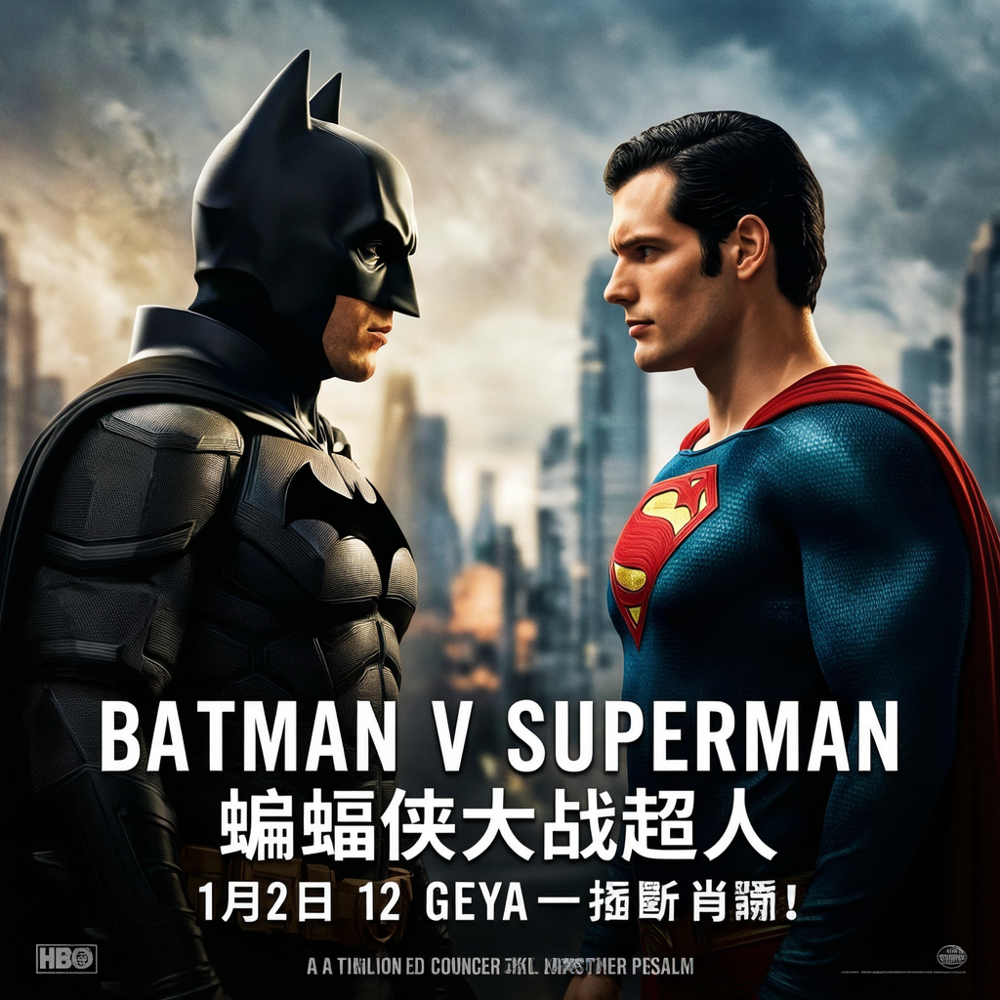

# 零依赖！我用 Python 标准库写了个 AI 画图工具，一句话生成高质量图片

> 不装 pip install，不依赖第三方库，仅用 Python 内置模块就能把自然语言变成高质量图片。这就是 image-gen——一个完整的 AI 图片生成管线。

---

## 背景：AI 画图为什么总是"差一口气"？

用过 AI 画图工具的开发者都知道，大多数工具的流程是这样的：输入一段文字描述 → 调用 API → 返回一张图。

这个流程看似简单，但实际问题不少：

- 用户描述太随意，模型理解有偏差
- 生成质量不可控，不满意只能重来
- 没有经验积累，每次生成都是"从零开始"
- 中文支持差，尤其文字渲染几乎不可用

image-gen 就是为了解决这些问题而诞生的。它不是又一个"包装 API"的壳，而是一套**结构化的、可迭代的、会学习**的图片生成管线。

---

## 核心架构

image-gen 的核心是一个 6 步管线，将自然语言描述转化为高质量图片：

```
自然语言描述 → 意图识别 → 知识图谱查询 → Prompt 生成 → ComfyUI 出图 → 评估与迭代 → 经验积累
```

下面逐一拆解每个步骤。

---

## 1、零外部依赖的核心引擎

image-gen 最硬核的地方在于：**核心引擎仅使用 Python 标准库**。

没有 torch、没有 transformers、没有 requests。整个 engine 目录下的所有模块，只用了 `urllib`、`json`、`pathlib`、`re` 这些 Python 内置模块。

```python
# scripts/engine/comfyui.py — 仅用 urllib 实现 ComfyUI HTTP 客户端
import urllib.request
import urllib.error
import json

def check_connection(cfg):
    try:
        url = f"http://{cfg['comfyui_host']}:{cfg['comfyui_port']}/system_stats"
        with urllib.request.urlopen(url, timeout=5) as resp:
            return resp.status == 200
    except Exception:
        return False
```

这意味着什么？意味着你 clone 下来就能跑，不需要 `pip install` 任何东西（当然 ComfyUI 本身还是需要装的）。

---

## 2、PromptKG：提示知识图谱

image-gen 内置了一个轻量级知识图谱引擎 `PromptKG`，用于管理和推荐提示实体。

它的数据结构包含三类信息：

- **实体字典**：12 个分类（主体、风格、情绪、构图、光照、背景、色调、颜色、类型、技法、纹理、主题），每个实体有中英文双语标注和出现频次
- **共现统计**：记录哪些实体组合经常一起出现，用于推荐
- **模板索引**：记录历史上成功的实体组合和对应的 Prompt

```python
from kg.engine import PromptKG

kg = PromptKG()
skeleton = kg.skeleton(["subject:cat", "style:watercolor"])

# 返回：
# filled: 已匹配的维度（subject, style）
# recommendations: 推荐的未填充维度（mood:warm, lighting:natural...）
# example_prompts: 历史成功模板
```

以"水彩猫"为例，KG 会推荐：

- 情绪：warm（共现分 52）
- 光照：natural light（共现分 35）
- 色调：warm tones

这一步解决了"用户描述太简单"的问题——系统能自动补全用户没想到但有助于出图的细节。

---

## 3、14 维结构化 Prompt Schema

image-gen 不使用普通的大段文字 Prompt，而是采用 14 维结构化 JSON 格式：

| 维度 | 说明 | 示例 |
|------|------|------|
| subject | 主体内容 | "a cat sitting on windowsill" |
| style | 艺术风格 | "watercolor" |
| mood | 情绪氛围 | "warm, cozy" |
| composition | 构图方式 | "close-up, centered" |
| lighting | 光照设置 | "natural light from window" |
| background | 背景环境 | "indoor" |
| color_palette | 色调方案 | "warm tones" |
| text_content | 图片中的文字 | "秋日味道" |
| typography_layout | 中文排版 DSL | 支持竖排、弧形等 |
| confrontation | 对比构图 | left vs right 对比 |
| technical_specs | 质量参数 | 分辨率、采样步数 |
| layout | 文字布局 | text-above / text-below |
| negative_constraints | 排除项 | blurry, watermark, deformed |
| aspect_ratio | 宽高比 | "3:4" / "16:9" |

这种结构化的好处是每个维度可以独立控制，KG 推荐也能精确到维度级别。

---

## 4、评估循环：让机器给自己打分

image-gen 的核心亮点之一是评估迭代循环。

生成图片后，系统会用视觉模型从 6 个维度打分：

| 维度 | 权重 | 说明 |
|------|------|------|
| 主体准确度 | 25% | 图片是否匹配描述的主体 |
| 风格还原度 | 20% | 艺术风格是否正确呈现 |
| 情绪传达 | 15% | 氛围/情绪是否到位 |
| 构图质量 | 15% | 布局是否合理 |
| 技术质量 | 15% | 清晰度、细节、分辨率 |
| 整体满意度 | 10% | 整体美观度 |

如果加权得分低于阈值（默认 8 分），系统会：

1. 分析优点和不足
2. 生成改进版 Prompt
3. 释放显存后重新生成
4. 最多迭代 3 轮

```
--- Iteration 1/3 ---
  Score: 6.5/8
  Weaknesses: 猫的姿势不够自然，水彩笔触感不足
  Refining prompt for next iteration...

--- Iteration 2/3 ---
  Score: 8.2/8
  Passed threshold! Stopping.
```

这一步解决了"生成质量不可控"的问题——不满意的图不会直接给你，系统会自己先修。

---

## 5、中文排版 DSL

对于需要在图片中渲染中文文字的场景，image-gen 内置了一套中文排版 DSL：

```json
{
  "text_content": "秋日味道",
  "layout": "text-overlay-bottom",
  "typography_layout": {
    "font": "Noto Sans SC",
    "size": 72,
    "alignment": "center",
    "direction": "horizontal"
  }
}
```

支持横排、竖排、弧形、居中等多种排版方式，配合 GGUF 量化模型可以在消费级显卡上实现不错的中文文字渲染效果。

---

## 6、经验积累：越用越聪明

每次评分达标的生成结果，系统会自动记录到知识图谱中：

- 更新实体共现计数
- 添加新的模板索引条目
- 异步翻译新实体的中文名

这意味着你用得越多，KG 的推荐就越精准。比如第一次用"赛博朋克猫"可能效果一般，但成功后下次类似的组合就能直接参考这次的经验。

```python
# KG 更新逻辑（原子写入，防止并发冲突）
def update_kg(used_entities, positive_prompt, score, threshold=8):
    if score < threshold:
        return False
    
    # 1. 更新共现计数
    for e1, e2 in combinations(used_entities, 2):
        graph["co_occurrence"][e1][e2] += 1
    
    # 2. 添加新模板
    if frozenset(used_entities) not in existing_tag_sets:
        graph["prompt_index"].append(new_entry)
    
    # 3. 原子写入
    _atomic_json_save(GRAPH_PATH, graph)
```

---

## 生成效果展示

以下是实际运行效果（更多示例见项目 `output/` 目录）：

> **输入描述**：pipeline-002 实际生成




---

## 快速上手

安装好 ComfyUI 后（见安装指南），只需一行命令：

```bash
python scripts/image-gen.py "a cat sitting on a windowsill, watercolor style"
```

或者用统一 CLI 做更精细的控制：

```bash
# 完整管线
python scripts/image-gen-cli.py pipeline --prompt "画一只水彩猫"

# 分步控制
python scripts/image-gen-cli.py intent --text "水彩猫"
python scripts/image-gen-cli.py evaluate --image result.png --prompt "水彩猫"
```

---

## 总结

1. image-gen 是一个完整的 AI 图片生成管线，将自然语言通过 6 步流程转化为高质量图片
2. **核心引擎零外部依赖**，仅使用 Python 标准库（urllib、json、pathlib），clone 即可运行
3. PromptKG 知识图谱基于共现统计实现智能推荐，解决"用户描述太简单"的问题
4. 14 维结构化 Prompt Schema 让每个维度可独立控制，支持中文排版 DSL 和对比构图
5. 评估循环通过视觉模型 6 维度加权打分，低于阈值自动优化重试，解决"质量不可控"
6. 经验积累机制将成功组合回写 KG，系统越用越聪明

---

**项目地址：** [GitHub - image-gen](https://github.com/your-username/image-gen)

**安装指南：** 见项目 `docs/install-guide.md`
